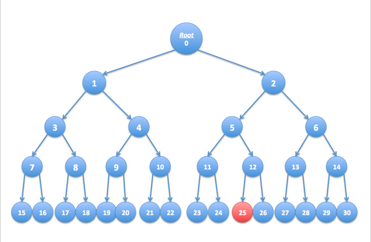

### Question 1

Data compression is often used in data storage and transmission. Suppose you want to use data compression in conjunction with encryption. Does it make more sense to:

- [] The order does not matter -- neither one will compress the data.

- [] Encrypt then compress.

- [] The order does not matter -- either one is fine.

- [x] Compress then encrypt.

#### Explaination: 

- The order does not matter - if the text is encrypted first, it will look random and compression will not really work. If compressed and then encrypted, the compression will work. 

- Ciphertexts tend to look like random strings and therefore the only opportunity for compression is prior to encryption

### Question 2: 

Let $G: {0,1}^s \Rightarrow {0,1}^n$be a secure PRG. Which of the following is a secure PRG  (there is more than one correct answer):

- [] $G^\prime (k)=G(0)$

**Explaination**: a distinguisher will output *not random* whenever its input is equal to $G(0)$

- [x] $G^\prime (k)=G(k) \oplus 1^n$  

**Explaination**: a distinguisher for $G^\prime$ gives a distinguisher for $G$

- [] $G^\prime (k)=G(k) || 0$     

(here || denotes concatenation)

**Explanation**: a distinguisher will output *not random* whenever the last bit of its input is 0

- [x] $G^\prime (k1,k2) = G(k1) || G(k2)$     

(here ||​ denotes concatenation)

**Explaination**: a distinguisher for $G^\prime$ gives a distinguisher for $G$

- [] $G^\prime (k) = G(k) || G(k)$

**Explaination**: A distinguish will output *not random* whenever the first bit n bits are equal to the last n bits

- [x] $G^\prime (k) = $ reverse($G(k)$) where reverse(x) reverses the string x so that the first bit of x is the last bit of reverse(x), the second bit of x is the second to last bit of reverse(x), and so on.

**Explaination**: a distinguisher for $G^\prime$ gives a distinguisher for $G$


### Question 3: 

Let $G: K \Rightarrow {0,1}^n$ be a secure PRG

Define $G^\prime (k_1, k_2) = G(k_1) \wedge G(k_2)$ where $\wedge$ is the bit-wise AND function. Consider the following statistical test **A** on ${0,1}^n$

$A(x)$ output **LSB(x)**, the least significant bit of $x$. 

What is $Adv_{PRG}[A, G^\prime]$ ? 

You may assume that **LSB(G(k))** is 0 for exactly half the seeds $k$ in $K$. 

Note: Please enter the advantage as a decimal between 0 and 1 with a leading 0. If the advantage is $3/4$, you should enter it as 0.75

**Answer**: 0.25

**Explaination**: 

For a random string x we have *Pr*$[A(x) = 1] = \frac{1}{2}$ but for a pseudorandom string $G^\prime (k_1, k_2)$ we have $Pr_{k_1, k_2}[A(G^\prime (k_1, k_2)) = 1] = \frac{1}{4}$


### Question 4: 

Question 4

Let $(E, D)$ be a (one-time) semantically secure cipher with key space $K={0,1}^\ell$. A bank wishes to split a decryption key $k \in {0,1}^\ell$ into two pieces $p_1$​ and $p_2$​ so that both are needed for decryption. The piece p1p1​ can be given to one executive and p2p2​ to another so that both must contribute their pieces for decryption to proceed.

 The bank generates random $k_1$​ in ${0,1}^\ell$ and sets $k1^\prime \Leftarrow k \oplus k_1$​. Note that $k_1 \oplus k1′ = 1$. The bank can give $k_1$​ to one executive and $k_1^\prime$​ to another. Both must be present for decryption to proceed since, by itself, each piece contains no information about the secret key k (note that each piece is a one-time pad encryption of k).

 Now, suppose the bank wants to split kk into three pieces $p_1,p_2,p_3$ so that any two of the pieces enable decryption using k. This ensures that even if one executive is out sick, decryption can still succeed. To do so the bank generates two random pairs $(k_1,k_1^\prime)$ and $(k_2,k_2^\prime)$ as in the previous paragraph so that $k_1 \oplus k_^\prime =k2 \oplus k_2^\prime = k$. 

How should the bank assign pieces so that any two pieces enable decryption using k, but no single piece can decrypt?

- [] $p_1=(k_1,k_2),p_2 = (k_1^\prime,k_2^\prime),p_3=(k_2^\prime)$

**Explaination**: executives 2 and 3 cannot decrypt\

- [] $p_1=(k_1,k_2),p_2=(k_2,k_2^\prime),p_3 = (k_2^\prime)$

**Explaination**: executives 1 and 2 can decrypt using $k_2, k_2^\prime$, executives 1 and 3 can decrypt using $k_2, k_2^\prime$, and executives 2 and 3 can decrypt using $k_2, k_2^\prime$ but in $p_2, k_2$ and $k_2^\prime$ can decrypt so invalid

- [x] $p_1=(k_1,k_2),p_2=(k_1,k_2),p_3=(k_2^\prime)$

**Explaination**: executives 1 and 2 can decrypt using $k_2, k_2^\prime$, executives 1 and 3 can decrypt using $k_2, k_2^\prime$, and executives 2 and 3 can decrypt using $k_2, k_2^\prime$

- [] $p_1=(k_1,k_2),p_2=(k_1^\prime),p_3=(k_2^\prime)$

**Explanation**: executives 2 and 3 can not decrypt

- [] $p_1=(k_1,k_2),p_2=(k_1^\prime,k_2),p_3=(k_2^\prime)$

**Explaination**: executives 2 and 3 can not decrypt

### Question 5:

Let $M = C = K = {0, 1, 2, ..., 255}$

and consider the following cipher defined over $(K, M, C)$

$E(K, M) = m + k$ (mod 256) ; $D(k, c) = c - k$ (mod 256)

Does this cipher has perfect secrecy ? 

- [] No, there is a simple attack on this cipher

- [] No, only the One Time Pad has perfect secrecy 

- [] Yes

**Explaination**: as with the one-time pad, there is exactly one key mapping a given message m to a given ciphertext c


### Question 6: 

Let $(E, D)$ be a (one-time) semantically secure cipher where the message and ciphertext space is ${0,1}^n$. Which of these following encryption schemes are (one-time) semantically secure ? 

- [x] $E^\prime(k,m) = 0 || E(k,m)$ (i.e. prepend to the ciphertext)

**Explaination**: An attacker on $E^\prime$ gives an attacker on E

- [x] $E^\prime((k, k^\prime), m) = E(k,m) || E(k^\prime, m)$

**Explaination**: An attacker on $E^\prime$ gives an attacker on E

- [] $E^\prime(k,m) = E(0^n, m)$

**Explaintation**: To break semantic security, an attacker would ask for the encryption of $0^n$ and $1^n$ and can easily distinguish EXP(0) from EXP(1) because it knows the secret key, namely $0^n$

- [x] $E^\prime(k,m) = $ compute $c \Leftarrow E(k,m)$ and output $c || c$ (i.e ., output $c$ twice)

**Explainantion**: an attacker on $E^\prime$ gives an attacker on $E$

- [] $E^\prime(k,m) = E(k,m) || k$

**Explaination**: To break semantic security, an attacker would read from the secret key from the challenger ciphertext and use it to decrypt the challenge ciphertext. Basically, any ciphertext reveals the secret key. 

- [] $E^\prime(k,m) = E(k,m) || LSB(m)$

**Explaination**: To break semantic security, an attacker would ask for the encryption of $0^n$ and $0^{n-1}1$ and can distinguish EXP(0) from EXP(1)

### Question 7: 

Suppose you are told that the one time pad encryption of the message "attack at dawn" is *6c73d5240a948c86981bc294814d*

(the plaintext letters are encoded as 8-bit ASCII and the given ciphertext is written in hex
). What would be the one time pad encryption of the message "attack at dusk" under the same OTP key?

**Solution**: 

```python
def str_to_int(s):
    return int(s.encode().hex(), 16)


key = str_to_int("attack at dawn") ^ 0x09e1c5f70a65ac519458e7e53f36

print(hex(str_to_int("attack at dusk") ^ key))
```
### Question 8: 

The movie industry wants to protect digital content distributed on DVD’s. We develop a variant of a method used to protect Blu-ray disks called AACS.

Suppose there are at most a total of $n$ DVD players in the
world (e.g. $n=2^32$). We view these $n$ players as the leaves of a binary tree of height $log⁡_2n$. Each node in this binary tree contains an AES key $k_i$​. These keys are kept secret from consumers and are fixed for all time. At manufacturing time each DVD player is assigned a serial number $i \in [0,n−1]$. Consider the set of nodes $S_i$​ along the path from the root to leaf number $i$ in the binary tree. The manufacturer of the DVD player embeds in player number ii the keys associated with the nodes in the
set $S_i$​. A DVD movie $m$ is encrypted as $E(k_{root},k) || E(k,m)$ where $k$ is a random AES key called a content-key and $k_{root}$​ is the key associated with the root of the tree. Since all DVD players have the key $k_root$​ all players can decrypt the movie m. We refer to $E(k_{root},k)$ as the header and $E(k,m)$ as the body. In what follows the DVD header may contain multiple ciphertexts
where each ciphertext is the encryption of the content-key $k$ under some key kiki​ in the binary tree.

Suppose the keys embedded in DVD player number $r$ are exposed by hackers and published on the Internet. In this problem we show that when the movie industry distributes a new DVD movie, they can encrypt the contents of the DVD using a slightly larger header (containing about log⁡2n keys) so that all DVD players, except for player number $r$, can decrypt the movie. In effect, the movie industry disables player number $r$ without affecting other players.

As shown below, consider a tree with n=16 leaves. Suppose the leaf node labeled 25 corresponds to an exposed DVD player key. Check the set of keys below under which to encrypt the key $k$ so that every player other than player 25 can decrypt the DVD. Only four keys are needed.



- [] 3

- [] 12

- [] 2

- [] 6

- [] 26 

- [] 1

- [x] 11

- [] 21

**Explaination**: There is a beter solution that does not requiring encrypting on the key of this node. 

Chúng ta thấy rằng những node không thể đi được tới 25: 

- Node 1

- Node 3 

- Node 4

- Node 7

- Node 8

- Node 11

- Node 6

- Node 13

- Node 14

### Question 9: 

Continuing with the previous question, if there are $n$ DVD players, what is the number of keys under which the content key $k$ must be encrypted if exactly one DVD player's key needs to be revoked ? 

- [] $n - 1$

- [] $\sqrt{n}$

- [] $n/2$

- [x] $log_2n$

**Explaination**: That's right, the key will need to encrypted under one key for each node on the path from the root to the revoked leaf. There are $log_2n$ nodes on the path. 
- [] 2

### Question 10: 

Continuing with quetion 8, suppose that leaf nodes labeled 16, 18, and 25 correspond to exposed DVD player keys. Check the smallest set of keys under which to encrypt the key k so that every player other than players 16, 18, 25 can decrypt the DVD. Only six keys are needed 

- [x] 4

**Explaination**: Yes, this will let players 19-22 decrypt

- [] 6 

- [] 11 

- [] 15

- [] 17

- [x] 26

**Explaination**: Yes, this will let players 26 decrypt 
- [] 8

- [] 13

- [] 14

- [] 20

