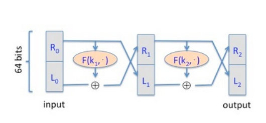

1.
Question 1

Consider the following five events:

- [[]] Correctly guessing a random 128-bit AES key on the first try.

- [[]] Winning a lottery with 1 million contestants (the probability is $\frac{1}{10^6}$ ). 

- [[]] Winning a lottery with 1 million contestants 5 times in a row (the probability is $\frac{1}{10^6}^5$ ).

- [[]] Winning a lottery with 1 million contestants 6 times in a row. 

- [[]] Winning a lottery with 1 million contestants 7 times in a row. 

What is the order of these events from most likely to least likely?
1 point

- [(x)] 2, 3, 4, 1, 5

- [()] 2, 3, 1, 5, 4

- [()] 2, 3, 5, 4, 1

- [()] 3, 2, 5, 4, 1

#### Explaination

- Correctly guessing a random 128-bit AES key on the first try. So the probability is $\frac{1}{2^128}$

$$(\frac{1}{10^6})^7 < \frac{1}{2^{128}} < (\frac{1}{10^6})^6 < (\frac{1}{10^6})^5 \frac{1}{10^6}$$

The events have the following probabilities:
    1. 2^-128 ~= 10^-38.5
    2. 10^-6
    3. 10^-30
    4. 10^-36
    5. 10^-42

So the probability order from most to least likely is
2,3,4,1,5

2.
Question 2

Suppose that using commodity hardware it is possible to build a computer for about $200 that can brute force about 1 billion AES keys per second. 

Suppose an organization wants to run an exhaustive search for a single 128-bit AES key and was willing to spend 4 trillion dollars to buy these machines (this is more than the annual US federal budget). How long would it take the organization to brute force this single 128-bit AES key with these machines?  Ignore additional costs such as power and maintenance.
1 point

- [()] More than a billion (109109) years

- [()] More than a week but less than a month
 
- [(x)] More than a million years but less than a billion (109109) years

- [()] More than an hour but less than a day

- [()] More than a month but less than a year

#### Explaination

At $200 each With 4 trillion = $4*10^12, the orgainization could
purchase 2*10^10 such machines.  With each machine testing 10^9 keys per second,
the orgainization could test 2*10^19 ~= 2^64.11 keys/second.

There $2^128$ different AES keys. To test all possible keys, it would take
roughly $2^64$ seconds, which is roughly $5.8*10^11$ years.
That's more than $10^9$ years.

3.
Question 3

Let F:{0,1}n×{0,1}n→{0,1}n be a secure PRF (i.e. a PRF where the key space, input space, and output space are all {0,1}n{0,1}n) and say n=128n=128.

Which of the following is a secure PRF (there is more than one correct answer):
1 point

- [[]] $F′(k,x)=F(k,x)  \oplus  0$    

(here $\oplus$​ denotes concatenation) 

### Explainatinon: 

Not a PRF. A distinguisher will output not a random whenever the last bit of $F(k, 0^n)$ is 0

- [[]] $F′(k,x)=F(k, x)  \oplus  F(k, x \oplus 1^n)$

#### Explaination: 

Not a PRF. A distinguisher will query at $x = 0^n$ and $x = 1^n$ and output not random whenever the two responses are equal. This is unlikely to happen for a truly random function

- [[x]] $F′(k,x)=F(k,x)[0,…,n−2]$
(i.e., F′(k,x) drops the last bit of F(k,x)F(k,x))

#### Explaination: 

Correct. A distinguisher for $F'$ gives a distinguisher for $F$. 

- [[]] $F′(k, x)=k \oplus x$

#### Explaination: 

This function is _not secure_ because the adversary can send $m_1 = 0$, then send $m_2 = f(m_1) \oplus X$.  If $b = 0$, he will always get back $X$ and will therefore guess $b = 1$ if he does not. If $b = 1$, he will not get back $X$ and will guess correctly again.  So Adv[A,F] = 1.

- [[x]] $F′((k1,k2), x)=F(k1,x)  \oplus  F(k2,x)$ (here $\oplus$ denotes concatenation)

#### Explaination: 

This function _is secure_. If there were an adversary A who had an advantage for this function, we could create an adversary B with an advantage for F as follows.

When A sends a message $m_i$, B sends $m_i$.  B takes the response $R$ and sends $R || R$ to A. A has a non-negligible probability of determining whether R
is random or $F(k, m_i)$.

- [[]] $F′((k1,k2), x)=\begin{cases}F(k1,x) \quad \text{when} x \neq 0^n \\
k_2 \quad \text{otherwise}\end{cases}​$

#### Explaination

4.
Question 4

Recall that the Luby-Rackoff theorem discussed in The Data  Encryption Standard lecture

 states that applying a three round Feistel network to a secure PRF gives a secure block cipher.  Let's see what goes wrong if we only use a two round Feistel.

Let $F:K×{0,1}32→{0,1}32$ be a secure PRF.

Recall that a 2-round Feistel defines the following PRP 

F2: K2 ×{0,1}64→{0,1}64F2​:K2×{0,1}64→{0,1}64:

Here $R_0$​ is the right 32 bits of the 64-bit input and L0L0​ is the left 32 bits.

One of the following lines is the output of this PRP F2F2​ using a random key, while the other three are the output of a truly random permutation f:{0,1}64→{0,1}64f:{0,1}64→{0,1}64. All 64-bit outputs are encoded as 16 hex characters.

Can you say which is the output of the PRP?       Note that since you are able to distinguish the output of F2F2​ from random, F2F2​ is not a secure block cipher, which is what we wanted to show.

Hint: First argue that there is a detectable pattern in the xor of F2(⋅, 064)F2​(⋅, 064) and F2(⋅, 132032)F2​(⋅, 132032).   Then try to detect this pattern in the given outputs.
1 point

- [[]] On input $0^64$ the output is  "e86d2de2 e1387ae9".     

- [[]] On input $1^320^32$ the output is "1792d21d b645c008".

- [[]] On input $0^64$ the output is "5f67abaf 5210722b".     

- [[]] On input $1^320^32$ the output is "bbe033c0 0bc9330e".

### Sol: 
Ý tưởng là xem từng đáp án một, tìm đẳng thức giữa L0 và R2. R0 toàn 0 => L1 toàn 0 -> R2 = F(k2) của R1 , R1 = F(K1)

R2 và R2' là đảo bit của nhau, output ==> Check kiểm tra đảo bit của nhau từng cái output

Ví dụ: 

- 290b6e3a và d6f491c5 ta có 2 = 0010 => Đối của binary là 1101: d...

When the input is 0^64:
R0 = 0, L0=0
R1 = F(k1,0), L1=0
R2 = F(k2, F(k1,0)), L2 = F(k1,0)

When the input is 1^32 || 0^32:
R0 = 0, L0 = 1
R1 = 1 xor F(k1, 0), L1 = 0
R2 = F(k2, 1 xor F(k1, 0)), L2 = 1 xor F(k1, 0)

so the first L2 should be the inverse of the second L2.
This is the case for the pair _e86..., 179_

Question 5

Nonce-based CBC.  Recall that in Lecture 4.4

 we said that if one wants to use CBC encryption with a non-random unique nonce then the nonce must first be encrypted with an independent PRP key and the result then used as the CBC IV.

Let's see what goes wrong if one encrypts the nonce with the same PRP key as the key used for CBC encryption. 

Let F:K×{0,1}ℓ→{0,1}ℓF:K×{0,1}ℓ→{0,1}ℓ be a secure PRP with, say, ℓ=128ℓ=128.  Let nn be a nonce and suppose one encrypts a message mm by first computing IV=F(k,n)IV=F(k,n) and then using this IV in CBC encryption using F(k,⋅)F(k,⋅).  Note that the same key kk is used for computing the IV and for CBC encryption.  We show that the resulting system is not nonce-based CPA secure.

The attacker begins by asking for the encryption of the two block message m=(0ℓ,0ℓ)m=(0ℓ,0ℓ) with nonce n=0ℓn=0ℓ.  It receives back a two block ciphertext (c0,c1)(c0​,c1​).  Observe that by definition of CBC we know that c1=F(k,c0)c1​=F(k,c0​). 

Next, the attacker asks for the encryption of the one block message m1=c0⨁c1m1​=c0​⨁c1​ with nonce n=c0n=c0​.  It receives back a one block ciphertext c0′c0′​.

What relation holds between c0,c1,c0′c0​,c1​,c0′​?    Note that this relation lets the adversary win the nonce-based CPA game with advantage 1.
1 point

- [] $c_0′=c_0 \oplus 1ℓ$

- [] $c_0=c_1 \oplus c_0'$

- [x] $c1=c0′​$
### Explaination: 

First, note that
c0 = F(k, F(k, 0))
c1 = F(k, F(k, F(k, 0)))
and that c1 = F(k, c0)

In response to the attacker's request for the encryption of m1=c0 ^ c1 with
nonce c0, the attacker receives:

nonce |  c'0
  c0  |  F(k,F(k,c0)^m1) = F(k,F(k,c0)^c0^c1) = F(k,c1^c0^c1) = F(k,c0) = c1

So _c'0 = c1_

- [] $c1=c0$​

Question 6

Let $m$ be a message consisting of ℓℓ AES blocks

(say ℓ=100ℓ=100).  Alice encrypts mm using CBC mode and transmits

the resulting ciphertext to Bob.  Due to a network error,

ciphertext block number $\mathcal{l}/2$ is corrupted during transmission.

All other ciphertext blocks are transmitted and received correctly.

Once Bob decrypts the received ciphertext, how many plaintext blocks will be corrupted?

- [x] 2

### Answer: 
If block number l/2 is corrupted, then that block and each block that comes
after will be corrupted, so _2_ blocks of plaintext will be corrupted.

- [] 0

- [] ℓℓ

- [] 3

- [] ℓ/2ℓ/2
7.
Question 7

Let mm be a message consisting of $\math{cal}$ AES blocks (say $\mathcal{l}=100$).  Alice encrypts mm using randomized counter mode and transmits the resulting ciphertext to Bob.  Due to a network error,
ciphertext block number $\mathcal{l}/2$ is corrupted during transmission.

All other ciphertext blocks are transmitted and received correctly.

Once Bob decrypts the received ciphertext, how many plaintext blocks

will be corrupted?

- [x] 1

### Explaination: 

With ctr, the counter value used to decrypt each block of ciphertext does not depend on the value of any other block.  Therefore with one block corrupted,
only _1_ block of plaintext will be corrupted. 

- [] 0

- [] $\mathcal{l}/2$

- [] 2

- [] $1 + \mathcal{l}/2$
8.
Question 8

Recall that encryption systems do not fully hide the length of transmitted messages. Leaking the length of web requests has been used to eavesdrop on encrypted HTTPS traffic to a number of web sites, such as tax preparation sites, Google searches, and healthcare sites.

Suppose an attacker intercepts a packet where he knows that the packet payload is encrypted using AES in CBC mode with a random IV.  The encrypted packet payload is 128 bytes.  Which of the following messages is plausibly the decryption of the payload:
1 point

- [x] 93: In this letter I make some remarks on a general principle relevant to enciphering in general and my machine.'

### Explaination: 

The strings have length:

'If qual...' -> 124
'The sig...' -> 165
'In this...' -> 108
'To cons...' -> 221

Each character is encoded to one byte. The messages of length 165 and 221
are too big to encrypt to 128 bytes.  The message of length 124 could not have
been encrypted to 128 bytes because the IV requires 16 bytes to send.

So the message of length 108 encrypted to 124 bytes, with 4 bytes of padding.

- [] 125: The significance of this general conjecture, assuming its truth, is

easy to see. It means that it may be feasible to design ciphers that

are effectively unbreakable.'

- [] 89: The most direct computation would be for the enemy to try all $2^r$ possible keys, one by one.'

- [] 109: If qualified opinions incline to believe in the exponential

conjecture, then I think we cannot afford not to make use of it.'
9.

Bản mã là 128 bytes

- 109 thêmm 2IV nếu p padding tối đa thêm 16 bytes nữa => 125 bytes nhỏ hơn 128 bytes => padding thêm 3 bytes là 128 bytes

- 93 + 2 IV = 99

- 125 + 2IV = Vượt quá 128 bytes

- 89 
Question 9

Let $R:={0,1}^4$ and consider the following PRF $F:R^5 \times R \Rightarrow R$ defined as follows:

$F(k,x):=\begin{cases}t=k[0] for i=1 to 4 doif (x[i−1]==1)t=t⊕k[i] output tF(k,x):=⎩⎪⎪⎪⎨⎪⎪⎪⎧​t=k[0] for i=1 to 4 do \\ if (x[i−1]==1)t=t \oplus k[i]\\ output t​$ 

That is, the key is k=(k[0],k[1],k[2],k[3],k[4])k=(k[0],k[1],k[2],k[3],k[4]) in R5R5 and the function at, for example, 01010101 is defined as F(k,0101)=k[0]⊕k[2]⊕k[4]F(k,0101)=k[0]⊕k[2]⊕k[4].

For a random key kk unknown to you, you learn that 

F(k,0110)=0011 F(k,0110)=0011  and  F(k,0101)=1010  F(k,0101)=1010  and  F(k,1110)=0110  F(k,1110)=0110 . 

What is the value of F(k,1101)F(k,1101)?        Note that since you are able to predict the function at a new point, this PRF is insecure.
1 point

### Answer: 

We are given to following.
k[0]^k[2]^k[3] = 0011
k[0]^k[2]^k[4] = 1010
k[0]^k[1]^k[2]^k[3] = 0110

We aim to find k[0]^k[1]^k[2]^k[4].

k[0]^k[1]^k[2]^k[4] = 0110^k[3]^k[4] = 0110^1010^k[0]^k[2]^k[3]
= 0110^1010^0011 = _1111_
